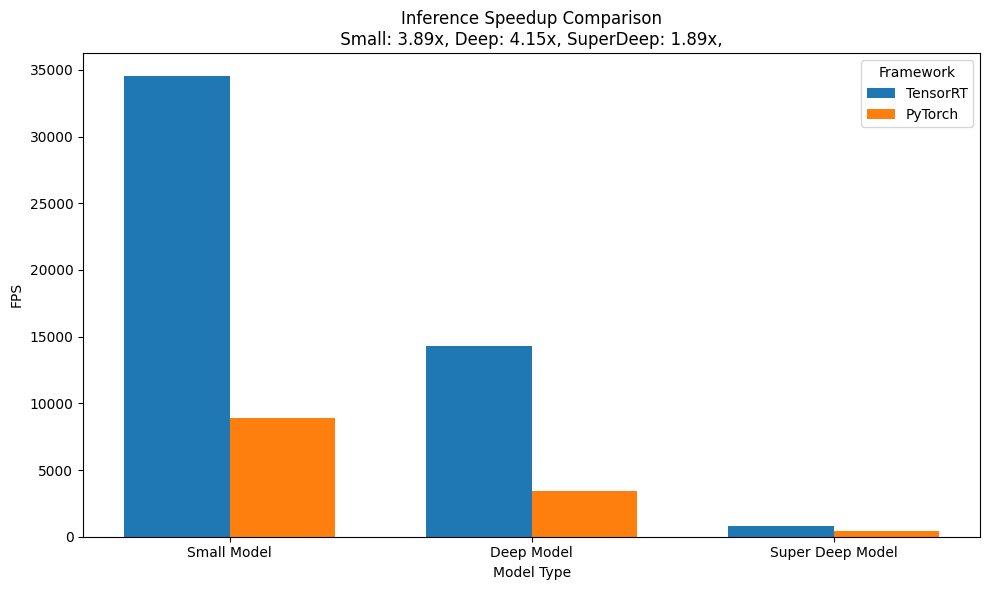
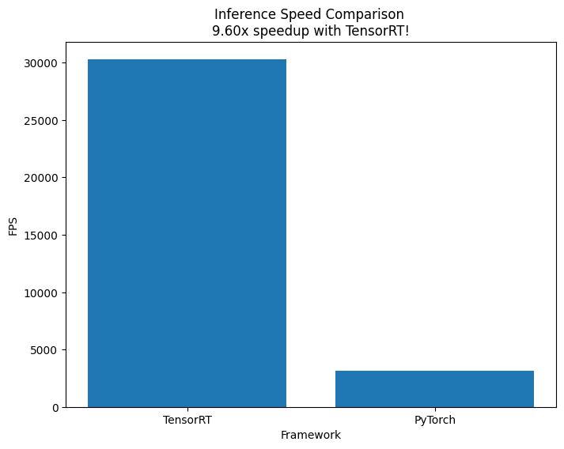
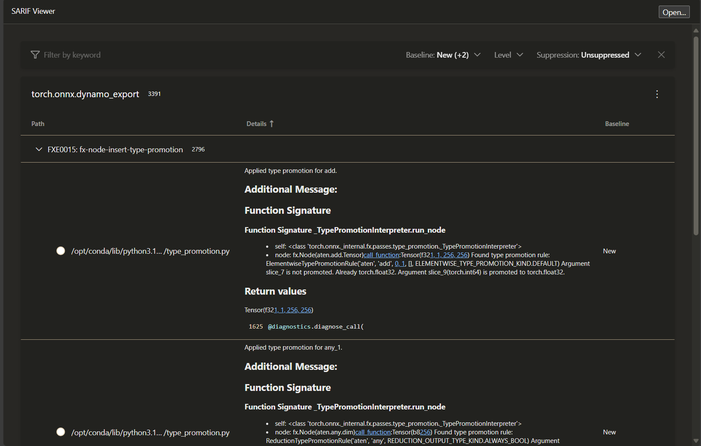
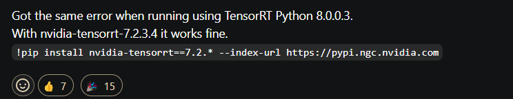
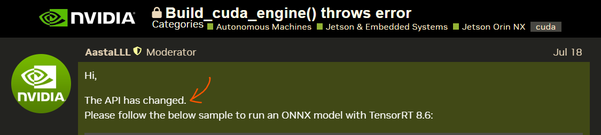
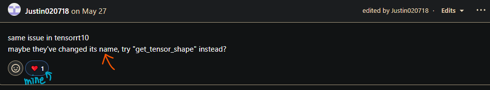

# Manual TensorRT Conversion and Optimization - LLM Optimization

> This repo is an attempt to explore the TensorRT framework by NVIDIA.

**Objective: Convert an LLM to TensorRT without existing automated pipelines like TensorRT-LLM**


### LLM to TensorRT Conversion
Select any open-source LLM. Manually convert the chosen model to TensorRT without using TRT-LLM. Document the step-by-step conversion process, including
- Dynamic shape handling
- Making KV Cache static
- Network definition and layer creation
- Weight extraction and setting

### Benchmarking and Analysis
Compare this in the offline mode with HF transformers with FlashAttention and Frozen KV Cache. Provide a detailed analysis of performance improvements and any trade-offs.

### Deliverables:
Source code for both parts with comprehensive documentation. Technical report covering:
- Optimization strategies
- TensorRT conversion process and challenges
- Performance analysis and benchmarking results
- Recommendations for further optimization
Also add Jupyter notebook or script demonstrating benchmarking process and results.


### Note: Extra points for integrating this LLM with a simple DRY sampler implementatio

---
---


# UNDERSTANDING CONCEPTS
> Given that almost all terms mentioned above are new for me 😅, let me provide notes on what all they mean. 

### ONNX
The ONNX Runtime library can load an exported ONNX model and perform inference. ONNX Runtime is optimised for running ONNX models efficiently, and it can take advantage of various hardware accelerators (e.g., GPU, TensorRT) to further improve the inference speed.

Source [Official repo](https://github.com/microsoft/onnxruntime)


### Dynamic Shape Handling
In the context of language models, dynamic shapes refer to the ability to handle input sequences of varying lengths, rather than being limited to a fixed size. When you export the model to ONNX, you define the **`dynamic axes`** for the input tensors, such as `input_ids`, `attention_mask`, and `position_ids`. All other axes will be treated as static, and hence fixed at runtime. This **allows the ONNX model to accept inputs of different sequence lengths during inference, without the need to pre-define a maximum length**.

For example, the `input_ids` tensor has two dimensions: `batch_size` and `sequence_length`. By defining the `batch_size` dimension as dynamic (`{0: 'batch_size'}`), the ONNX model can accept input sequences of varying lengths, as long as the batch size remains the same. This is possible because when we set the dynamic shape of the input tensors, the **engine will automatically adjust its internal buffers** and computations to accommodate the new shape.

Source [HuggingFace Docs](https://huggingface.co/docs/optimum/en/exporters/onnx/package_reference/configuration#configuration-classes-for-onnx-exports)


### Weight Stripping Nice notes on model
Once the Tensor RT engine has been created, having the option to strip weights helps to create and optimize an engine without unnecessary weights. It is more fast and no duplicate weights are used. We use it while inferencing, when the engine is loaded and refit with onnx weights. I am not fully clear but it means though.  

Source [NVIDIA Docs](https://docs.nvidia.com/deeplearning/tensorrt/developer-guide/index.html#weightless-build), [Official Repo](https://github.com/NVIDIA/TensorRT/tree/main/samples/python/sample_weight_stripping)


### StaticCache
A Static Cache allows reusing the cached values from previous computations, rather than recomputing them for each new token. This significantly improves the inference speed of the model, as it avoids the overhead of creating and managing the cache dynamically.
The `StaticCache` class in the `transformers` library is used to initialize and manage the KV cache. **This class pre-allocates the cache tensors with a fixed size**, and the model can then efficiently access and update these cached values during inference.

However, I learnt that `StaticCache` by itself won't be faster -- it only shines together with `torch.compile`. 

A comparision with the usual Dynamic Cache -

|                        | **Dynamic Cache**                                                                                 | **Static Cache**                                                                                 |
|------------------------|---------------------------------------------------------------------------------------------------|--------------------------------------------------------------------------------------------------|
| Purpose            | Automatically manages the cache for each forward pass. Suitable for single-pass inference where the cache is not reused across multiple calls. | Persists the cache across multiple forward passes. **Useful for generating sequences token by token, where the cache needs to be reused**. |
| Usage              | Typically used when you don't need to persist the cache between different inference calls.        | Requires manual management of the cache, ensuring that the cache is updated and reused correctly. |


Quoted from the Docs - \
A `StaticCache` object can be passed to the model’s `generate()` under the past_key_values argument. The object will retain the cache contents, so you can pass it to a new `generate()` call to continue generation, **like you would do with a dynamic cache**. \
If you want to go further down a level, the `StaticCache` object can also be passed to the model’s forward pass under the same `past_key_values` argument. Using this strategy, you can write your own function to decode the next token given the current token and position and cache position of previously generated tokens.


Source [HuggingFace Docs](https://huggingface.co/docs/transformers/main/en/llm_optims?static-kv=advanced+usage%3A+control+Static+Cache#static-kv-cache-and-torchcompile), [Transformers Issues](https://github.com/huggingface/transformers/issues/33270#issuecomment-2444830657)

> This understanding, along with [this Github issue](https://github.com/huggingface/transformers/issues/30670#issuecomment-2096809195) helps us to navigate into making **token by token generation**. On the other hand, directly calling the `model.generate` method, which would continue generation, as with a dynamic cache. I make this update in Notebook 2, however, with not much success.


---
---


# THE CODE

## NOTEBOOK 1 
**`notebooks/Sarvam-TensorRT_Sahil_EXPORT_ONNX.ipynb`**

High-level steps
- Create a simple wrapper around the Tinyllama model that defines `past_key_values` (using `StaticCache`) and `cache_position` arguments which are used in the model's forward pass. 
```python
# Forward pass with static cache
outputs = self.model(
    input_ids=input_ids,
    attention_mask=attention_mask,
    position_ids=position_ids,
    past_key_values=past_key_values,
    cache_position=cache_position,
    use_cache=True,
    return_dict=False
)
```
- Define `dynamic_axes` to support variable `batch_size` and `sequence_length`. 
- Export the model to ONNX. The dummy input tensors (`dummy_input_ids`, `dummy_attention_mask`, `dummy_position_ids`) are used as example inputs for the ONNX export process. The `opset_version` is slightly notorious!
- Load the ONNX. Start an `InferenceSession` and get outputs. 
- Leverage the `np.testing.assert_allclose` to check if the outputs from this ONNX model and the usual model are similar. Till an absolute tolerace of *1e-04*, the outputs are similar. 
- Define functions to prepare inputs i.e. generate the `input_ids`, `position_ids`, and `attention_mask`. Decode the logits back to text.


#### RESULT
The outputs do not hold any meaning!

| **Input** | **Output** |
| ----------| ---------  |
| Describe Albert Einstein |  *amedamed The And Be.ededed And And Andeded\n A A A A\n\n\n\n And And ...* |


## NOTEBOOK 2
**`notebooks/Sarvam-TensorRT_Sahil_EXPORT_ONNX_StaticCache.ipynb`** \
The main logic reamians the same, except, we try to decode tokens one by one. Since the official docs mention how using StaticCache with this method should work, we expect the outputs to be better. 

#### RESULT
These are much better, but certainly not the best.

| **Input** | **Output** |
| ----------| ---------  |
| Describe Albert Einstein |  *2019.\nThe 2019 edition of the annual event will be* |
| How does the sun burn? |  *2019\nThe 2019 edition of the World Economic Forum's* |


## NOTEBOOK 3
**`notebooks/Sarvam-TensorRT_Sahil_ConvertTRT.ipynb`**

With issues over the model's ONNX export and the Tensor RT library not accepting it, this notebook works with Neural Nets. More details in the *Issues I faced section* below.

The objective of this notebook becomes to check inference speedups while using the Tensor RT framework. 

> Interestingly, this framwork does not run on Kaggle GPUs! One gets a warning about the current GPUs not being supported. Very weird. This is why I switch to Colab

High-level steps include
- Define models. I use three models, starting from a 2-layer simple, and end up with a 32-layer deep model trying to mimic an LLM. 
- Building the TensorRT engine from the ONNX model This requires a bunch of features to be properly defined, like the logger, the builder etc. 
- Load the Saved Engine and execute. This involves allocating buffers and preparing input data. The code is quite complex. Took a lot of time to get it running!
- Run the benchmarking code snip for all models. Since there is a variaion in each run, we perform 1000 iterations, repeated 10 times :)


# BENCHMARKING
We define the metric FPS (Frames per Second) as number of iterations (fixed at 1000) over the time taken. It is evident that small models are inherently faster. As the size of models increase, their FPS decreases. \

The gain in speedup after converting models to Tensor RT follows the same pattern too!. For the most complex model, the gains diminish the least.  

|**Model**| **Tensor RT FPS** | **Pytorch FPS** | **Speedup**  |
| ----   | ---- | ----| ---- | 
|  Small |     34526.20 | 8877.71  | **3.89x** |
|  Deep |     14315.33 | 3451.91  | **4.15x** |
|  Super Deep |     831.16 | 439.69  | **1.89x** | 


 \


> NOTE: This excercise should be taken with a pinch of salt! Even though I have tried to have 1000 iterations repeated 10 times to get the average FPS values, these averages still differ a lot. 

My experiments have yeilded speedups of upto 10x for the Small and Deep model and upto 5x for the Super Deep model. The *mean* Pytorch FPS values for the Small model range from 3000 to 9000. This massive variation should be checked in more detail further. With LLMs, the model complexity and parameter counts increasing manifold!

The image below is one of the charts during my experiments - from the Small model 😀


---

# Drawbacks of (blindly using!) TensorRT 

- Precision differences: TensorRT uses different numerical precision than PyTorch, which  lead to small differences in output of model. 

- Dynamic shapes: PyTorch models can have dynamic input shapes, meaning that input shape can vary from one inference to next. **TensorRT requires static input shapes**, meaning that the input shape must be known and fixed at time of engine creation. Input shape must be manually specified when creating the TensorRT engine.

- Memory usage: TensorRT engines require additional memory for storing intermediate results and optimization data. TensorRT also killed my kernels when I tried running on the CPU.

- TensorRT version: The version of TensorRT used for engine creation and inference should be compatible with the version of PyTorch used to create the original model. Otherwise, the conversion process may fail or the performance may be suboptimal.

Source [Hengtao Tantai's Blog](https://medium.com/@zergtant/accelerating-model-inference-with-tensorrt-tips-and-best-practices-for-pytorch-users-7cd4c30c97bc)


---

# Issues I faced

### With the ONNX export
By far the biggest issue I faced. I started with the [LLaMA2-7B model](https://www.kaggle.com/models/metaresearch/llama-2/Code?modelIds=735&sortBy=voteCount&excludeNonAccessedDatasources=true), but it turned out to be too heavy for my Kaggle system.Then shifted to the [Phi2 model](https://www.kaggle.com/models/Microsoft/phi/transformers/2), however, its ONNX dump worth 12 GB was enough to give oom errors 😅. Finally shifted to the [TinyLLaMA model](https://www.kaggle.com/models/mambagetout/tinyllama) which at about 1B params and a 4GB ONNX model seemed okay. 

Interestingly, the simple `torch.onnx.export` command led to failed exports on Kaggle. A notebook mentioned about first creating an empty file using `!touch model.onnx` and then writing to it - which worked!


However, the model's ONNX version is not a single file. When the ONNX outputs exceed a 2 GB upper cap, protobuf splits the model's weights into hundreds of files. This leads to the `onnx.checker.check_model` giving a *ValueError: Message onnx.ModelProto exceeds maximum protobuf size of 2GB: 4402590179*. Still, the `model.onnx` file is supposed to *bind* all the weights together. 

Getting inferences with this ONNX file with the `onnxruntime` works well. We spin up an `onnxruntime` session and good to go
> Refer Notebook 1

**However, TensorRT does not accept this ONNX file!** This is the main issue. The ONNX file is just not parsed. It complains about not finding certain weight files. Even working with specific settings within the `torch.onnx.export` like `export_params`, which says weights won't be exported to seperate files - doesn't work. Trying with the new `dynamo_export` option doesn't help too. Other options to export the model like the HuggingFace `Optimum` tool were also explored, but with large models like LLMs, issues persist.

The errors also pointed to checking a `sarif_report` of the exported ONNX model, which would enable manual checking of the exported graph. However, I feel I might need additional time to debug this. Below is a snippet from the sarif report. 




After spending quite some time to find a workaround, I shift to trying with a simple Neural Net and going ahead with converting to TensorRT and subsequent benchmarking. Shall go over this issue sometime again.

Source [Github Issue](https://github.com/pytorch/pytorch/issues/94280#issuecomment-2089196400), [Pytorch Blogs](https://pytorch.org/tutorials/advanced/super_resolution_with_onnxruntime.html), [Pytorch Docs](https://pytorch.org/docs/main/onnx_torchscript.html#torch.onnx.export)


#### Past Issues  with tinyllama
There have been issues while converting small models like TinyLLaMA to ONNX. The library seems to still be in development and support for new models is being added continuously.  

Source [Optimum Issues](https://github.com/huggingface/optimum/issues/1606#issuecomment-1866507683), [Pytorch Issues](https://github.com/pytorch/pytorch/issues/74732), [Transformer Issues](https://github.com/huggingface/transformers/issues/28981)


### Versioning

 \
However, installing these results in ERROR: No matching distribution found! This is because NVIDIA doesn't support anything before Version 8 now removed everything upto Version 7 [check official releases!](https://docs.nvidia.com/deeplearning/tensorrt/release-notes/index.html). \
For a while it seemed like all the tutorials and blogs online were in Version 7. Thankfully, it wasn't the case everywhere.


### The API keeps changing
Since this is a rapidly expanding library, frequent API changes make life slightly difficult. 




Here are a few attributes that caused by head to spin!
- `context_execute_async_v2` (deprecated) vs `context_execute_async_v3` (new)
- `engine.binding_is_input` (deprecated) vs `engine.get_tensor_mode` (new)
- `engine.max_batch_size` (deprecated) vs only supports the value 1 (new) 
- *a few more!*

Source [NVIDIA forums](https://forums.developer.nvidia.com/t/build-cuda-engine-throws-error/300198/3), [Github Issues](https://github.com/NVIDIA/trt-samples-for-hackathon-cn/issues/104), [More Issues](https://github.com/NVIDIA-AI-IOT/torch2trt/issues/557#issuecomment-841523481)


### Not using local builds
Expectedly, the TRT library is built for GPUs. I resorted to using Colab and Kaggle. This had a few major downsides since I could not leverage popular libraries that would have made things simpler.

#### trtexec
The `trtexec` command line wrapper seems like a lightweight tool to convert `onnx` models to TensorRT format directly. However running it on Kaggle (even as a subprocess) doesn't seem possible. One has to build it from the repo and set correct path variables etc. Source [building trtexec.](https://github.com/NVIDIA/TensorRT/tree/main/samples/trtexec)

#### onnx-tensorrt
Similarly, the `onnx-tensorrt` library allows to convert `onnx` models to TensorRT format directly. However, again, running on Kaggle systems doesnt seem possible :/ Building the repo locally seems to be the way which isn't possible for me. Source [building onnx-tensorrt.](https://github.com/onnx/onnx-tensorrt?tab=readme-ov-file#building)


# REFERENCES
The open-source community is amazing. Cannot praise them enough. Here are a few links that helped me on the way - 
- NVIDIA's [Quick Start Guide](https://docs.nvidia.com/deeplearning/tensorrt/archives/tensorrt-861/quick-start-guide/index.html) and [Developer Guide](https://docs.nvidia.com/deeplearning/tensorrt/archives/tensorrt-861/developer-guide/index.html#perform_inference_python) specially the inference sections, [Starter Notebooks](https://github.com/NVIDIA/TensorRT/tree/main/quickstart/IntroNotebooks) but they used `trtexec`!, and their [repo](https://github.com/NVIDIA/TensorRT/tree/main/samples/python/sample_weight_stripping)
- Pytorch [docs](https://pytorch.org/docs/stable/onnx_torchscript.html#torch.onnx.export) 
- ONNX [docs](https://onnxruntime.ai/docs/tutorials/mobile/helpers/make-dynamic-shape-fixed.html)
- HuggingFace's [AMAZING blog](https://huggingface.co/docs/transformers/main/en/llm_optims?static-kv=advanced+usage%3A+control+Static+Cache#static-kv-cache-and-torchcompile)
- Blogs on Medium by [Fateme Bafghi](https://medium.com/@fatemebfg/tensorrt-conversion-transforming-deep-learning-models-for-high-speed-inference-36548bdca46c) - great help to understand concepts, [Max Melichov](https://medium.com/@maxme006/how-to-create-a-tensorrt-engine-version-10-4-0-ec705013da7c), [Vilson Rodrigues](https://vilsonrodrigues.medium.com/a-friendly-introduction-to-tensorrt-building-engines-de8ae0b74038), [Hengtao Tanai](https://medium.com/@zergtant/accelerating-model-inference-with-tensorrt-tips-and-best-practices-for-pytorch-users-7cd4c30c97bc) - the benchmarking code is from his blogs!
- Github Repos by [Sithu Aung](https://github.com/sithu31296/PyTorch-ONNX-TRT/tree/master)