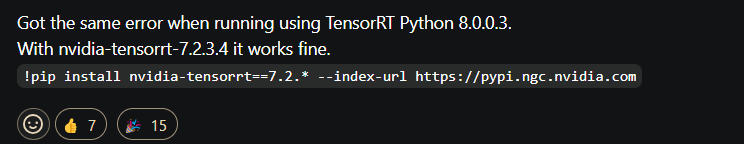
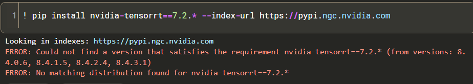

@oobabooga yeah, StaticCache by itself won't be faster -- it only shines together with torch.compile

self.model.context.set_tensor_shape(0, dynamic_shape): We set the dynamic shape of the TensorRT engine's input tensor to the dynamic_shape tensor we created. This tells the engine to expect input tensors with the specified shape.

The dynamic shape handling is taken care of by the TensorRT engine, which is designed to handle inputs with varying shapes. When we set the dynamic shape of the input tensor, the engine will automatically adjust its internal buffers and computations to accommodate the new shape.

In this specific case, the dynamic shape handling is used to enable the model to process input sequences of varying lengths. By setting the dynamic shape of the input tensor, we allow the engine to adapt to different sequence lengths, which is essential for many NLP tasks.

To illustrate this, let's consider an example:

Suppose we have a batch of input sequences with lengths 10, 20, and 30. We can create a single input tensor with shape (3, 30) (where 3 is the batch size and 30 is the maximum sequence length). We can then set the dynamic shape of the input tensor to (3, 10), (3, 20), and (3, 30) respectively, to indicate the actual sequence lengths for each batch element.

The TensorRT engine will then adjust its internal buffers and computations to process each batch element with the correct sequence length, without requiring us to create separate input tensors for each sequence length.

# onnx
Once exported to ONNX format, a model can be:

optimized for inference via techniques such as graph optimization and quantization.

# Dynamic axes 
https://huggingface.co/docs/optimum/en/exporters/onnx/package_reference/configuration#configuration-classes-for-onnx-exports

The dynamic axes. These refer to the input dimensions can be changed dynamically at runtime (e.g. a batch size or sequence length). All other axes will be treated as static, and hence fixed at runtime.

# Claude explaination
- **Dynamic Shapes**: Yes, the code you provided allows the model to handle dynamic shapes. In the context of language models, dynamic shapes refer to the ability to handle input sequences of varying lengths, rather than being limited to a fixed size.

When you export the model to ONNX, you define the **dynamic axes** for the input tensors, such as input_ids, attention_mask, and position_ids. This **allows the ONNX model to accept inputs of different sequence lengths during inference, without the need to pre-define a maximum length**.

Making a model handle dynamic shapes is important because the length of input text can vary significantly, and you **don't want to limit your model to a specific maximum length**. Dynamic shapes allow the model to be more flexible and applicable to a wider range of use cases.

- **Static KV Cache**: Yes, the code also makes the model's key-value (KV) cache static. In large language models (LLMs), the attention mechanism uses a cache to store the key and value tensors from previous attention computations. This cache is used to speed up the attention computation during text generation.
By making the **KV cache static, the model can reuse the cached values from previous computations, rather than recomputing them for each new token**. This significantly improves the inference speed of the model, as it avoids the overhead of creating and managing the cache dynamically.
In the provided code, the **StaticCache** class is used to initialize and manage the KV cache. **This class pre-allocates the cache tensors with a fixed size (e.g., 32 in the example)**, and the model can then efficiently access and update these cached values during inference.

Regarding loading the ONNX model and running inferences, you can use a library like **ONNX Runtime** to load the exported ONNX model and perform inference. ONNX Runtime is optimized for running ONNX models efficiently, and it can take advantage of various hardware accelerators (e.g., GPU, TensorRT) to further improve the inference speed.

The wrapper you mentioned, `ModelWrapper`, is a simple class that defines the model's forward method explicitly. This is necessary because the original model's forward method expects a specific set of arguments, which may include optional or conflicting inputs (like `inputs_embeds`). By creating a wrapper, we can control the inputs and outputs more precisely for the ONNX export.

Now, let's explain the key concepts in more detail:

## Past Key Values and Cache Position:
In large language models, the attention mechanism uses a cache to store the key and value tensors from previous attention computations. This cache is used to speed up the attention computation during text generation. 

For example, let's say you have a sequence of input tokens: "The quick brown fox". When the model processes the first token "The", it computes the key and value tensors for the attention mechanism. These tensors are then stored in the cache, along with the position of the token in the sequence (i.e., the **cache position**). 

When the model processes the next token "quick", it can reuse the cached key and value tensors for the previous token "The", instead of recomputing them. This is done by passing the cached key and value tensors, along with the new cache position (which is now 1), to the attention mechanism.

By reusing the cached values, the model can generate text much more efficiently, as it doesn't need to recompute the attention for each new token. This is why making the KV cache static is important - it allows the model to access and update the cache efficiently during inference.

## Dynamic Axes:
The dynamic axes in the ONNX export are used to specify **which dimensions of the input tensors can vary in size during inference**. In the provided code, the dynamic axes are defined for `input_ids`, `attention_mask`, and `position_ids`.

For example, the `input_ids` tensor has two dimensions: `batch size` and `sequence length`. By defining the batch size dimension as dynamic ({0: 'batch_size'}), the ONNX model can accept input sequences of varying lengths, as long as the batch size remains the same.

The dummy input tensors (`dummy_input_ids`, `dummy_attention_mask`, `dummy_position_ids`) are used to provide example inputs for the ONNX export process. The ONNX exporter needs these example inputs to understand the shape and data types of the model's inputs, so that it can properly define the input and output signatures of the ONNX model.

During inference, you can provide your actual input data (e.g., a batch of text sequences) to the ONNX model, and it will be able to handle the dynamic shapes thanks to the way the export was configured.

> In summary, the code you provided allows the TinyLlama model to handle dynamic input shapes and static KV caching, which can significantly improve the inference performance of the model. By exporting the model to ONNX and using a library like ONNX Runtime, you can run efficient inference on the model and potentially see faster performance compared to the original Hugging Face model.

# On dynamic sizes not being handled well
The dynamic_axes in torch.onnx.export() should theoretically handle dynamic input shapes, but sometimes the internal operations (especially with the cache mechanism) can still expect fixed sizes. This is likely what's happening here

# Past Issues  with tinyllama
Even though this is not directly related to my issue, but surely there have been issues while converting small models like tinyllama to onnx. 
https://github.com/huggingface/optimum/issues/1606#issuecomment-1866507683

# Not all models are compatible with kv cache
https://github.com/huggingface/transformers/issues/28981!
It says llama and whisper only for now.

# Issues with Tensor RT LLM 
https://medium.com/@zergtant/accelerating-model-inference-with-tensorrt-tips-and-best-practices-for-pytorch-users-7cd4c30c97bc

Issues to be noted
When converting a PyTorch model to TensorRT engine, there are several issues should be noted:

- Precision differences: TensorRT uses different numerical precision than PyTorch, which lead to small differences in output of model. This is especially important to consider if model will be used in safety-critical applications.

- Dynamic shapes: PyTorch models can have dynamic input shapes, meaning that input shape can vary from one inference to next. TensorRT requires static input shapes, meaning that the input shape must be known and fixed at time of engine creation. Input shape must be manually specified when creating the TensorRT engine.

- Unsupported operations: Not all PyTorch operations are supported by TensorRT. Some operations may need to be manually implemented in TensorRT or replaced with supported operations that provide similar functionality.

- Memory usage: TensorRT engines require additional memory for storing intermediate results and optimization data. This means that memory requirements for TensorRT engine may be different than for the original PyTorch model, and should be taken into account when deploying model.

- TensorRT version: The version of TensorRT used for engine creation and inference should be compatible with the version of PyTorch used to create the original model. If the versions are not compatible, the conversion process may fail or the performance of the TensorRT engine may be suboptimal.

# Issues with the library
https://forums.developer.nvidia.com/t/build-cuda-engine-throws-error/300198/3
The API keeps changing

# TRT EXEC
The trtexec command line wrapper seems like a lightweight tool to convert onnx models to tensor rt. However running it on kaggle (even as a subprocess) doesnt seem possible. One has to build it from the repo and set correct path variables etc.

# Building locally
The onnx-tensorrt library allows to convert onnx models to tensor rt directly. However, again, running on kaggle systems doesnt seem possible :/ Building the repo locally seems to be the way which isn't possible for me.
https://github.com/onnx/onnx-tensorrt?tab=readme-ov-file#building